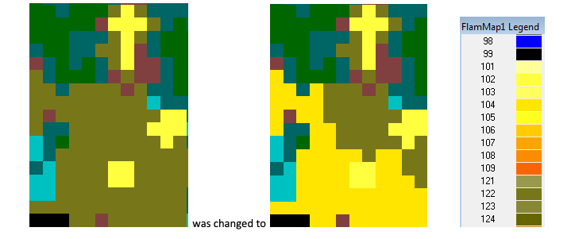

Landscape Service
=================

The Landscape Service allows users to create, edit and download landscapes files.
Landscape files can be created in either geotiff or LCP which is a raster file comprised of spatial information representing topography (slope, elevation, and aspect), fuel model, and canopy characteristics including canopy cover, canopy base height, canopy height, and canopy bulk density.

Access
******

.. warning::
    | Access is password protected. Please contact the Wildland Fire Management Research Development and Applications for access.

Swagger Account
---------------

|swagger_link|

.. |swagger_link| raw:: html

    <a href="http://192.255.42.9/landscapeREST/api/index.html" target="_blank">http://192.255.42.9/landscapeREST/api/index.html</a>

REST Endpoints
--------------

|rest_link|

.. |rest_link| raw:: html

    <a href="http://192.255.42.9/landscapeREST" target="_blank">http://192.255.42.9/landscapeREST</a>

Creating A Landscape
********************

.. Endpoint
.. --------
.. **POST** `http://192.255.42.9/landscapeREST/landscape/create`

Request Body
------------

.. note::
    | Currently we only accept :code:`x-www-form-urlencoded` response body.
    | We currently have data for the United States. If Latitudes and Longitudes fall outside of the United States then empty data cells will be returned.

+------------------+---------+----------+-----------------------+-------------------------------------------------------------+
| Param            | type    | Required | Options               | Description                                                 |
+==================+=========+==========+=======================+=============================================================+
|"West Longitude"  | number  | *true*   |-180 and +180          | *Decimal Degrees only*                                      |
|                  |         |          |                       | Cannot be more than "East Longitude"                        |
+------------------+---------+----------+-----------------------+-------------------------------------------------------------+
|"East Longitude"  | number  | *true*   |-180 and +180          | *Decimal Degrees only*                                      |
|                  |         |          |                       | Cannot be less than "West Longitude"                        |
+------------------+---------+----------+-----------------------+-------------------------------------------------------------+
|"North Latitude"  | number  | *true*   |-90 and +90            | *Decimal Degrees only*                                      |
|                  |         |          |                       | Cannot be less than "South Latitude"                        |
+------------------+---------+----------+-----------------------+-------------------------------------------------------------+
|"South Latitude"  | number  | *true*   |-90 and +90            | *Decimal Degrees only*                                      |
|                  |         |          |                       | Cannot be more than "North Latitude"                        |
+------------------+---------+----------+-----------------------+-------------------------------------------------------------+
|"Landfire Year"   | number  | *true*   | - 2012                +                                                             |
|                  |         |          | - 2014                +                                                             |
+------------------+---------+----------+-----------------------+-------------------------------------------------------------+
|"Resolution"      | integer | *true*   | 30 - 10000            |                                                             |
+------------------+---------+----------+-----------------------+-------------------------------------------------------------+
|"Fuel Model Type" | integer | *true*   | - 40                  |                                                             |
|                  |         |          | - 13                  |                                                             |
+------------------+---------+----------+-----------------------+-------------------------------------------------------------+
|"Edit Rules"      | string  | *true*   |  See `Edit Rules`_    |                                                             |
+------------------+---------+----------+-----------------------+-------------------------------------------------------------+
|"Generate Geotiff"| boolean | *true*   |                       |                                                             |
+------------------+---------+----------+-----------------------+-------------------------------------------------------------+

Response
--------

.. code-block:: json

    {
        "success": true,
        "queued": false,
        "includesWarningOrInfo": false,
        "multipleResponseMsgs": false,
        "msgCollector": null,
        "responseMessage": "Request to create landscape with ID 5404 has been submitted",
        "entityId": 5404
    }

+-------------------------+---------+
| Param                   | type    |
+=========================+=========+
|*success*                | boolean |
+-------------------------+---------+
|*queued*                 | boolean |
+-------------------------+---------+
|*includesWarningOrInfo*  | boolean |
+-------------------------+---------+
|*multipleResponseMsgs*   | boolean |
+-------------------------+---------+
|*msgCollector*           | string  |
+-------------------------+---------+
|*responseMessage*        | string  |
+-------------------------+---------+
|*entityId*               | integer |
+-------------------------+---------+

.. Editing A Landscape
.. *******************

.. Endpoint
.. --------

.. **POST** `http://192.255.42.9/landscapeREST/landscape/edit`

.. Request Body
.. ------------

.. +------------------------+---------+----------+-----------------------+-------------------------------------------------------------+
.. | Param                  | type    | Required | Options               | Description                                                 |
.. +========================+=========+==========+=======================+=============================================================+
.. |"Landscape Identifier"  | number  | *true*   |                       | A landscape ID from a previous landscape create             |
.. +------------------------+---------+----------+-----------------------+-------------------------------------------------------------+
.. |"Generate Geotiff"      | boolean | *true*   |                       |                                                             |
.. +------------------------+---------+----------+-----------------------+-------------------------------------------------------------+
.. |"Edit Rules"            | string  | *true*   |  See `Edit Rules`_    |                                                             |
.. +------------------------+---------+----------+-----------------------+-------------------------------------------------------------+

.. _`Edit Rules`:

Edit Rules
**********

The Landscape Service allows landscape files to be edited at the time of creation.  The Landscape Service also allows users to edit a landscape if it was previously created by that user within the Landscape Service.  Both LANDFIRE Lookup rules and user-defined edit rules can be used to edit a landscape file – either concurrently or through the creation of a series of landscape files.  Whenever Lookup and user-defined edit rules are concurrently used, the Lookup rules are always applied prior to the user-defined edit rules.  If multiple rules of a given type are applied, the rules of the same type are always applied in the given order.  However, there are differences between how a series of edit rules are applied and users should be aware of those differences when they choose to edit a landscape.

.. note::
    All edit rules are passed to the Landscape Service as :code:`JSON`. For Landscape Service Edit Rules, all strings are case insensitive.  Thus, "lookup" can be passed as "lookup", "Lookup", "LOOKUP", or "LooKUp".   It should also be noted that whitespace (spaces, tabs, carriage returns, and linefeeds) between the components is optional.

LANDFIRE Lookup Rules Syntax
----------------------------

The name for a LANDFIRE Lookup rule is "lookup".  Each LANDFIRE Lookup rule must contain three components (Category, Severity, and Timeframe) and each of the required components has three values that can be used.  There is also a fourth optional parameter (Mask) that can be used for a given rule.

+------------------+--------------+---------------+-------------------------------------------------------------------------------------------------------------+
| Component Name   | String Value | Numeric Value | Description                                                                                                 |
+==================+==============+===============+=============================================================================================================+
|Category          | - Wildfire   | - 1           | - Models fire behavior on the landscape                                                                     |
|                  | - Treatment  | - 2           | - Thinning without removal of slash                                                                         |
|                  | - Removal    | - 3           | - Thinning with removal of slash                                                                            |
+------------------+--------------+---------------+-------------------------------------------------------------------------------------------------------------+
|Severity          | - Low        | - 1           | - Low severity burn or light thinning                                                                       |
|                  | - Moderate   | - 2           | - Moderate severity burn or moderate thinning                                                               |
|                  | - Severe     | - 3           | - High severity burn or heavy thinning                                                                      |
+------------------+--------------+---------------+-------------------------------------------------------------------------------------------------------------+
|Timeframe         | - 1 year     | - 1           | - Models short term effects (1 year post treatment)                                                         |
|                  | - 4 years    | - 2           | - Models medium term effects (2 to 5 year post treatment)                                                   |
|                  | - 8 years    | - 3           | - Models long term effects (6 to 10 year post treatment)                                                    |
+------------------+--------------+---------------+-------------------------------------------------------------------------------------------------------------+
|Mask              |              | - Shape Id    | - *Optional* – the Id is the identifier returned for a given shape when it was uploaded to the service      |
+------------------+--------------+---------------+-------------------------------------------------------------------------------------------------------------+

Thus, if you want to obtain the long term landscape by modeling a moderate severity treatment without the removal of slash, you could pass any of the following:

.. code-block:: json

    {
        "lookup":{
            "category":"treatment",
            "severity":"moderate",
            "timeframe":"8 years"
        }
    }

Or

.. code-block:: json

    {
        "Lookup":  {
            "category":"treatment",
            "severity":"2",
            "timeframe":"3"
        }
    }

Or

.. code-block:: json

    {
        "LOOKUP":  {
            "CATEGORY":"2",
            "SEVERITY":"Moderate",
            "timeframe":"3"
        }
    }

You can also pass multiple Lookup rules at one time – either in an array or by repeating the "Lookup" name.  That is, the following two options are equivalent:

.. code-block:: json

    {
        "LOOKUP": [
            {
                "category":"treatment",
                "severity":"moderate",
                "timeframe":3
            },
            {
                "category":"wildfire",
                "severity":"low",
                "timeframe":1
            }
        ]
    }

Or

.. code-block:: json

    {
        "LOOKUP":{
            "category":"treatment",
            "severity":"moderate",
            "timeframe":3
        },
        "LOOKUP":{
            "category":"wildfire",
            "severity":"low",
            "timeframe":1
        }
    }

In the previous instance, the landscape would first be altered by a moderately severe treatment without removal of slash and then allowed to recover for 5 to 10 years.  After that, the landscape would experience a low severity burn and then be allowed to recover for 1 year.  If this set of rules were applied, the second lookup rule would be applied to the results of the first lookup rule.
In the two examples given, the LANDFIRE Lookup treatments were both applied to the entire landscape.  As previously mentioned, it is also possible to restrict a treatment by attaching a shape file to a given rule.  To do this, you would first need to upload one or more shape files to the Landscape Service and then apply an individual shape file identifier as a "mask" for the appropriate rule.  A shape file identifier is returned whenever a shape file is successfully uploaded to a service.   Assuming you had previously uploaded shapes with IDs of 174 and 2191, you could apply the previous pair of Lookup rules to different portions of the landscape using the following syntax:

.. code-block:: json

    {
        "LOOKUP": [
            {
                "category":"treatment",
                "severity":"moderate",
                "timeframe":3,
                "mask":174
            },
            {
                "mask":2191,
                "category":"wildfire",
                "severity":"low",
                "timeframe":1
            }
        ]
    }

You should also note that the order of the name/value pairs within a Lookup rule is inconsequential.  That is, "category", "severity", "timeframe" and "mask" can be passed in any order within a given rule.

User-Defined Edit Rules Syntax
------------------------------

The name for a user-defined edit rule is "edit".  A user-defined edit rule consists of a non-empty set of conditions as well as a non-empty set of attributes to change when those conditions are met.  As is the case with LANDFIRE Lookup rules, a user-defined edit rule can be applied across the entire landscape or restricted to a mask (uploaded shape file that intersects the landscape).  Other than the CV (clear value) change operator, each condition and change object associated with a user-defined edit rule requires three name/value pairs – "attribute", "operator", and "pair".  However, the set of operators available for a condition is distinct from the set of operators available for a change.  The following edit rule

.. code-block:: json

    {
        "edit": {
            "condition":{
                "attribute":"elevation",
                "operator":"eq",
                "value":-1
            },
            "change":{
                "attribute":"canopy cover",
                "operator":"st",
                "value":10
            }
        }
    }

implies that whenever the elevation is equal to -1 meter on the landscape, the canopy cover will be set to 10 percent.  As was the case with LANDFIRE Lookup rules, the order of the name/value pairs within a condition or change data object is irrelevant.  In addition, the order of condition or change data objects within a user-defined edit rule is also inconsequential.  However, the order of individual edit rules within an array of edit rules can be very consequential.  There are a couple of reasons for this but the primary reason is that once an individual attribute within a landscape cell is modified by a user-defined edit rule, it will not be modified by subsequent user-defined edit rules.

The Attribute Data Element
--------------------------
There are eight landscape attributes associated with each cell of a landscape file.  Three of these (elevation, slope, and aspect) cannot be modified within the Landscape Service.  The remaining five attributes (fuel model, stand height, canopy cover, canopy base height, and canopy bulk density) can be modified.  The following table specifies how these attributes can be used within a user-defined edit rule.

+---------------------+--------------+---------------+--------+----------------------------------------------------------------------------------------------------+
| Attribute           | Short Form   | Numeric Value | Change | Comments                                                                                           |
+=====================+==============+===============+========+====================================================================================================+
|Elevation            | elv          | 1             | No     | Elevation of landscape cell in meters                                                              |
+---------------------+--------------+---------------+--------+----------------------------------------------------------------------------------------------------+
|Slope                | slp          | 2             | No     | Slope of landscape cell in degrees (0 to 90)                                                       |
+---------------------+--------------+---------------+--------+----------------------------------------------------------------------------------------------------+
|Aspect               | asp          | 3             | No     | Aspect of landscape cell in degrees (0 to 360; -1 for no aspect, i.e. flat; 0 is north)            |
+---------------------+--------------+---------------+--------+----------------------------------------------------------------------------------------------------+
|Fuel Model           | fm           | 4             | Yes    | Fuel Model (both Fuel Model 40 and Fuel Model 13 values are acceptable)                            |
+---------------------+--------------+---------------+--------+----------------------------------------------------------------------------------------------------+
|Stand Height         | sh           | 5             | Yes    | Acceptable values range from 0 to 150 meters                                                       |
+---------------------+--------------+---------------+--------+----------------------------------------------------------------------------------------------------+
|Canopy Cover         | cc           | 6             | Yes    | Acceptable values range from 0 to 100 percent                                                      |
+---------------------+--------------+---------------+--------+----------------------------------------------------------------------------------------------------+
|Canopy Base Height   | cbh          | 7             | Yes    | Acceptable values range from 0 to 150 meters                                                       |
+---------------------+--------------+---------------+--------+----------------------------------------------------------------------------------------------------+
|Canopy Bulk Density  | cbd          | 8             | Yes    | Acceptable values range from 0 to 0.50 kg/m^3                                                      |
+---------------------+--------------+---------------+--------+----------------------------------------------------------------------------------------------------+

.. note::
    Note that the full attribute name, the short form, or the numeric value can be used to identify an attribute.

The Condition Operator Data Element
-----------------------------------

There are six condition operator data element values as defined in the following table.

+----------+------------------------------------------------------+
| Operator | The condition is true if the specified attribute...  |
+==========+======================================================+
|EQ        | is equal to the rule’s value                         |
+----------+------------------------------------------------------+
|GE        | is greater than or equal to the rule’s value         |
+----------+------------------------------------------------------+
|GT        | is greater than the rule’s value                     |
+----------+------------------------------------------------------+
|LE        | is less than or equal to the rule’s value            |
+----------+------------------------------------------------------+
|LT        | is less than the rule’s value                        |
+----------+------------------------------------------------------+

Multiple conditions can exist for the same attribute.  For example, between can be accomplished by using a combination of a greater than operator with a less than operator.  However, the logical operator between all conditions within a single edit rule is AND.

The Change Operator Data Element
--------------------------------

There are seven change operator data element values as defined in the following table.

+------------+---------------------------------------------------------------------------------------------------------------------------------------------------------+
| Operator   | The condition is true if the specified attribute...                                                                                                     |
+============+=========================================================================================================================================================+
|CM          | is equal to the rule’s value                                                                                                                            |
+------------+---------------------------------------------------------------------------------------------------------------------------------------------------------+
|CV :sup:`*` | Clear the value – set the attribute value to NO DATA (-9999)                                                                                            |
+------------+---------------------------------------------------------------------------------------------------------------------------------------------------------+
|CX          | Clamp to a maximum – if the attribute value is greater  than the associated value, set it to that value                                                 |
+------------+---------------------------------------------------------------------------------------------------------------------------------------------------------+
|DB          | Decrease by – subtract the associated value from the attribute value; if the new value is out of range, set it to the minimum value for the attribute   |
+------------+---------------------------------------------------------------------------------------------------------------------------------------------------------+
|IB          | Increase by – add the associated value to the attribute value; if the new value is out of range, set it to the maximum value for the attribute          |
+------------+---------------------------------------------------------------------------------------------------------------------------------------------------------+
|MB          | Multiply by – multiply the attribute value by the associated value; if the new value is out of range, set it to the maximum value for the attribute     |
+------------+---------------------------------------------------------------------------------------------------------------------------------------------------------+
|ST :sup:`*` | Set the attribute to the given value                                                                                                                    |
+------------+---------------------------------------------------------------------------------------------------------------------------------------------------------+

.. note::
    ST and CV are the only change operators that can be used for the fuel model attribute.

Unlike condition operators, multiple change attributes cannot exist for the same attribute.  That is, you cannot have a rule with two change operators that both set the canopy cover.

The Value Data Element
----------------------
For both condition and change data objects, the Value data element must be numeric.

Examples
^^^^^^^^

Multiple conditions within a user-defined edit rule are always ANDed together.  That is, all the conditions must be true in order for the associated changes to be applied.  You will need to use multiple user-defined edit rules to simulate an OR condition.
For example, the following edit rule changes all Grass-Shrub models that occur at an elevation less than 100 meters to fuel model 104 (GR4 - Moderate Load, Dry Climate Grass) with no canopy characteristics.

.. code-block:: json

    {
        "edit": {
            "condition": [
                {
                    "attribute": "elevation",
                    "operator": "lt",
                    "value": 100
                },
                {
                    "attribute": "fuel model",
                    "operator": "ge",
                    "value": 121
                },
                {
                    "attribute": "fuel model",
                    "operator": "lt",
                    "value": 130
                }
            ],
            "change": [
                {
                    "attribute": "fuel model",
                    "operator": "st",
                    "value": 104
                },
                {
                    "attribute": "stand height",
                    "operator": "st",
                    "value": 0
                },
                {
                    "attribute": "cc",
                    "operator": "st",
                    "value": 0
                },
                {
                    "attribute": "cbh",
                    "operator": "st",
                    "value": 0
                },
                {
                    "attribute": "cbd",
                    "operator": "st",
                    "value": 0
                }
            ]
        }
    }

That is:

If
    the elevation is less than 100 meters AND

    the fuel model is greater than or equal to 121 AND

    the fuel model is less than 130,

then
    change the fuel model to 104 AND

    the stand height to 0 meters AND

    the canopy cover to 0 percent AND

    the canopy base height to 0 meters AND

    the canopy bulk density to 0 kg / m^3.

The following images are from FlamMap 6 and were captured to display the before and after to verify that fuel model 122 was changed to fuel model 104 and that the canopy characteristics were all set to 0 provided that the elevation was less than 100 meters.

It is certainly possible to pass a user-defined edit rule that will not change any attributes on the landscape.  Consider the following syntactically correct user-defined edit rule.

.. code-block:: json

    {
        "edit":{
            "condition":[
                {
                    "attribute":"fm",
                    "operator":"le",
                    "value":121
                },
                {
                    "attribute":"fm",
                    "operator":"gt",
                    "value":130
                }
            ],
            "change":[
                {
                    "attribute":"fm",
                    "operator":"st",
                    "value":104
                }
            ]
        }
    }

In this edit rule, the condition can never be satisfied as it reads

If
    the fuel model is less than or equal to 121 AND

    the fuel model is greater than 130

The take away from this is that the Landscape Service will return an appropriate error message for landscape edit rules that are syntactically incorrect but it will not flag issues with edit rules that are logically incorrect.
Next, consider the following:

.. code-block:: json

    {
        "edit":[
            {
                "condition":[
                    {
                        "attribute":"elv",
                        "operator":"lt",
                        "value":100
                    },
                    {
                        "attribute":"fm",
                        "operator":"ge",
                        "value":121
                    },
                    {
                        "attribute":"fm",
                        "operator":"lt",
                        "value":130
                    }
                ],
                "change":{
                    "attribute":"fm",
                    "operator":"st",
                    "value":104
                }
            },
            {
                "condition":[
                    {
                        "attribute":"fm",
                        "operator":"ge",
                        "value":121
                    },
                    {
                        "attribute":"fm",
                        "operator":"lt",
                        "value":130
                    }
                ],
                "change":[
                    {
                        "attribute":"fm",
                        "operator":"st",
                        "value":109
                    },
                    {
                        "attribute":"sh",
                        "operator":"st",
                        "value":25.5
                    },
                    {
                        "attribute":"cc",
                        "operator":"st",
                        "value":18
                    },
                    {
                        "attribute":"cbh",
                        "operator":"st",
                        "value":3.7
                    },
                    {
                        "attribute":"cbd",
                        "operator":"st",
                        "value":0.02
                    }
                ]
            }
        ]
    }

In this instance, there are two edit rules.  The first edit rule sets existing Grass-Shrub fuel models to fuel model 104 provided the elevation is less than 100 meters but does not set any other cell attributes.  The second rule sets existing Grass-Shrub fuel models to fuel model 109 and also sets the canopy characteristics of the cell.  A potentially unintended consequence of these two rules is that the canopy characteristics of all the Grass-Shrub fuel models are set by the second rule since none of the canopy characteristics were set by the first rule.  There are two obvious solutions to this conundrum – either set all the attributes within the first edit rule OR add a condition to the second edit rule to avoid setting canopy characteristics for any of the cells touched by the first rule.  That is, you can increase the canopy characteristics by 0 so as to not change them with a subsequent edit rule

.. code-block:: json

    {
        "edit":[
            {
                "condition":[
                    {
                        "attribute":"elv",
                        "operator":"lt",
                        "value":100
                    },
                    {
                        "attribute":"fm",
                        "operator":"ge",
                        "value":121
                    },
                    {
                        "attribute":"fm",
                        "operator":"lt",
                        "value":130
                    }
                ],
                "change":[
                    {
                        "attribute":"fm",
                        "operator":"st",
                        "value":104
                    },
                    {
                        "attribute":"sh",
                        "operator":"ib",
                        "value":0
                    },
                    {
                        "attribute":"cc",
                        "operator":"ib",
                        "value":0
                    },
                    {
                        "attribute":"cbh",
                        "operator":"ib",
                        "value":0
                    },
                    {
                        "attribute":"cbd",
                        "operator":"ib",
                        "value":0
                    }
                ]
            },
            {
                "condition":[
                    {
                        "attribute":"fm",
                        "operator":"ge",
                        "value":121
                    },
                    {
                        "attribute":"fm",
                        "operator":"lt",
                        "value":130
                    }
                ],
                "change":[
                    {
                        "attribute":"fm",
                        "operator":"st",
                        "value":109
                    },
                    {
                        "attribute":"sh",
                        "operator":"st",
                        "value":25.5
                    },
                    {
                        "attribute":"cc",
                        "operator":"st",
                        "value":18
                    },
                    {
                        "attribute":"cbh",
                        "operator":"st",
                        "value":3.7
                    },
                    {
                        "attribute":"cbd",
                        "operator":"st",
                        "value":0.02
                    }
                ]
            }
        ]
    }

Or you can add a condition to the second rule to only modify cells with an elevation greater than or equal to 100 meters

.. code-block:: json

    {
        "edit":[
            {
                "condition":[
                    {
                        "attribute":"elv",
                        "operator":"lt",
                        "value":100
                    },
                    {
                        "attribute":"fm",
                        "operator":"ge",
                        "value":121
                    },
                    {
                        "attribute":"fm",
                        "operator":"lt",
                        "value":130
                    }
                ],
                "change":{
                    "attribute":"fm",
                    "operator":"st",
                    "value":104
                }
            },
            {
                "condition":[
                    {
                        "attribute":"elv",
                        "operator":"ge",
                        "value":100
                    },
                    {
                        "attribute":"fm",
                        "operator":"ge",
                        "value":121
                    },
                    {
                        "attribute":"fm",
                        "operator":"lt",
                        "value":130
                    }
                ],
                "change":[
                    {
                        "attribute":"fm",
                        "operator":"st",
                        "value":109
                    },
                    {
                        "attribute":"sh",
                        "operator":"st",
                        "value":25.5
                    },
                    {
                        "attribute":"cc",
                        "operator":"st",
                        "value":18
                    },
                    {
                        "attribute":"cbh",
                        "operator":"st",
                        "value":3.7
                    },
                    {
                        "attribute":"cbd",
                        "operator":"st",
                        "value":0.02
                    }
                ]
            }
        ]
    }

Combining LANDFIRE Lookup and User-Defined Edit Rules
-----------------------------------------------------

When a landscape is being edited, LANDFIRE Lookup rules are always applied before user-defined edit rules.  The primary reason for this is that LANDFIRE Lookup rules are based upon the existing vegetation (EV) characteristics (type, height, and cover) as well as the LANDFIRE map zone of a cell.  Since the vast majority of users are not aware of the existing vegetation characteristics of a cell, users are not allowed to edit the EV characteristics when they define a user-defined edit rule.  As a result, the three EV characteristics are unset when a user-defined edit rule modifies the fuel model, the canopy cover, or stand height of a cell.  When Lookup rules are applied to a cell whose existing vegetation characteristics are unset, Fuel Model Lookup rules are applied instead of LANDFIRE Lookup rules (since the information required for using LANDFIRE Lookup rules for that cell no longer exists).  It should be noted that Fuel Model Lookup rules are a generalized version of LANDFIRE Lookup rules and consequently not as precise.
Therefore, regardless of the relative order of Lookup and user-defined edit rules, the Lookup rules are always applied before the user-defined edit rules.  This does not mean that you cannot apply edit rules prior to Lookup rules – but to do so, you must first create an intermediate landscape to which the user-defined edit rules have been applied.  Next, you would apply Lookup rules to the intermediate landscape.

Thus, the following sets of edit rules

.. code-block:: json

    {
        "LOOKUP":[
            {
                "category":"treatment",
                "severity":"moderate",
                "timeframe":3
            },
            {
                "category":"wildfire",
                "severity":"low",
                "timeframe":1
            }
        ],
        "edit":[
            {
                "condition":[
                    {
                        "attribute":"elevation",
                        "operator":"lt",
                        "value":500
                    },
                    {
                        "attribute":"fuel model",
                        "operator":"eq",
                        "value":121
                    }
                ],
                "change":[
                    {
                        "attribute":"fuel model",
                        "operator":"st",
                        "value":123
                    },
                    {
                        "attribute":"stand height",
                        "operator":"mb",
                        "value":0.75
                    }
                ]
            },
            {
                "condition":[
                    {
                        "attribute":"slp",
                        "operator":"le",
                        "value":20
                    }
                ],
                "change":[
                    {
                        "attribute":"fuel model",
                        "operator":"st",
                        "value":147
                    },
                    {
                        "attribute":"stand height",
                        "operator":"mb",
                        "value":3.75
                    }
                ]
            }
        ],
    }

is equivalent to

.. code-block:: json

    {
        "edit":[
            {
                "condition":[
                    {
                        "attribute":"elevation",
                        "operator":"lt",
                        "value":500
                    },
                    {
                        "attribute":"fuel model",
                        "operator":"eq",
                        "value":121
                    }
                ],
                "change":[
                    {
                        "attribute":"fuel model",
                        "operator":"st",
                        "value":123
                    },
                    {
                        "attribute":"stand height",
                        "operator":"mb",
                        "value":0.75
                    }
                ]
            },
            {
                "condition":[
                    {
                        "attribute":"slp",
                        "operator":"le",
                        "value":20
                    }
                ],
                "change":[
                    {
                        "attribute":"fuel model",
                        "operator":"st",
                        "value":147
                    },
                    {
                        "attribute":"stand height",
                        "operator":"mb",
                        "value":3.75
                    }
                ]
            }
        ],
        "LOOKUP":[
            {
                "category":"treatment",
                "severity":"moderate",
                "timeframe":3
            },
            {
                "category":"wildfire",
                "severity":"low",
                "timeframe":1
            }
        ],

    }

and equivalent to

.. code-block:: json

    {
        "edit":[
            {
                "condition":[
                    {
                        "attribute":"elevation",
                        "operator":"lt",
                        "value":500
                    },
                    {
                        "attribute":"fuel model",
                        "operator":"eq",
                        "value":121
                    }
                ],
                "change":[
                    {
                        "attribute":"fuel model",
                        "operator":"st",
                        "value":123
                    },
                    {
                        "attribute":"stand height",
                        "operator":"mb",
                        "value":0.75
                    }
                ]
            },
            {
                "condition":[
                    {
                        "attribute":"slp",
                        "operator":"le",
                        "value":20
                    }
                ],
                "change":[
                    {
                        "attribute":"fuel model",
                        "operator":"st",
                        "value":147
                    },
                    {
                        "attribute":"stand height",
                        "operator":"mb",
                        "value":3.75
                    }
                ]
            },
        ],
        "LOOKUP":[
            {
                "category":"treatment",
                "severity":"moderate",
                "timeframe":3
            },
            {
                "category":"wildfire",
                "severity":"low",
                "timeframe":1
            }
        ]
    }

On the other hand, creating an intermediate landscape using the edit rules

.. code-block:: json

    {
        "edit":[
            {
                "condition":[
                    {
                        "attribute":"elevation",
                        "operator":"lt",
                        "value":500
                    },
                    {
                        "attribute":"fuel model",
                        "operator":"eq",
                        "value":121
                    }
                ],
                "change":[
                    {
                        "attribute":"fuel model",
                        "operator":"st",
                        "value":123
                    },
                    {
                        "attribute":"stand height",
                        "operator":"mb",
                        "value":0.75
                    }
                ]
            },
            {
                "condition":[
                    {
                        "attribute":"slp",
                        "operator":"le",
                        "value":20
                    }
                ],
                "change":[
                    {
                        "attribute":"fuel model",
                        "operator":"st",
                        "value":147
                    },
                    {
                        "attribute":"stand height",
                        "operator":"mb",
                        "value":3.75
                    }
                ]
            }
        ]
    }

followed by editing the intermediate landscape with the Lookup rules

.. code-block:: json

    {
        "LOOKUP":[
            {
                "category":"treatment",
                "severity":"moderate",
                "timeframe":3
            },
            {
                "category":"wildfire",
                "severity":"low",
                "timeframe":1
            }
        ]
    }

results in a dramatically different landscape.
